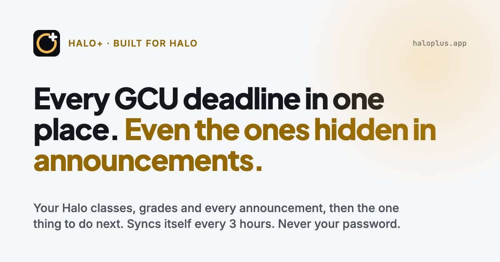
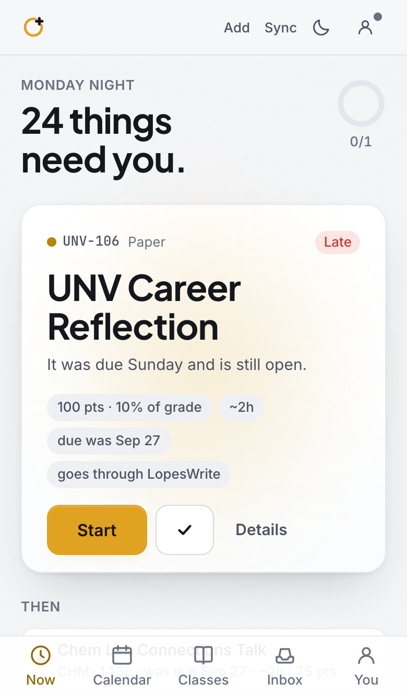

# Halo+

**The planner built for Halo.** All of Halo, read for you, even the announcements. Then the one thing to do next.

**Use it:** https://richardsgeorger-collab.github.io/school-dashboard/



Halo+ is an independent planner for GCU students. One bookmark syncs your classes, assignments, grades and every
announcement out of Halo, and one screen says what to do right now: the due date, how long it takes, what it is
worth. It never asks for your GCU password. It is not affiliated with, endorsed by, or connected to Grand Canyon
University; Halo is GCU's learning platform.

## What it does

- **Now.** One card for the one thing to do next, with why it was picked, what it is worth, how long it takes and
  the professor's own instructions from announcements. Then the short list of what comes after.
- **Announcements, read for you.** The "due Friday" a professor only posted in an announcement lands on the
  assignment it belongs to, as a checklist line quoting the post. Standing rules ("150 to 200 words, every week")
  live with the class. Every post arrives in the Inbox with a one-line summary. (Halo sync and the reading are part
  of Plus; every new account starts with seven days of Max free, no card.)
- **Study.** One tab: Ask anything about your classes (it knows your assignments, grades, slides, lectures and
  announcements, and answers short, with what to do next as buttons); Practice for any quiz or exam (a plan for the
  days left, a worksheet with the answers on the last page as Word or PDF, quiz me one question at a time,
  flashcards, all from your own class material); Check my work against the rubric or the class's method. Part of Max.
- **Grades.** Points earned over points graded per class, from Halo's gradebook, with what the number rests on
  ("based on 3 items"), what you need on the rest, and what skipping one thing would do.
- **Calendar, Load, Classes.** Week and month views, a heatmap of heavy weeks for the whole term, and a page per
  class with the next deadline, pace, rules and notes.
- **Reminders.** A morning note, a heads-up the night before a heavy day, a nudge when big work is untouched, a
  re-sync reminder, and on Max a Sunday recap. Push only, no email.
- **Phone or laptop.** Add it to your Home Screen and it works like an app. Your data follows you between devices
  when you sign in.

<p align="center"></p>

## How the sync works

The **Sync Halo** bookmark runs on Halo's own page while you are logged in there. It asks Halo for your classes,
assignments, grades and announcements the same way Halo's own app does, and hands the result to your Halo+ tab.
You approve every change before it applies. Tokens exist in the bookmark's local variables for the seconds it runs
and are never stored or sent anywhere else. The bookmark loads the current sync script from this site on every
click, so it never goes stale. Details: [docs/halo-sync.md](docs/halo-sync.md).

A Chrome extension makes opening Halo the sync (no bookmark to click); it can be loaded unpacked from
[extension/](extension/) until it is on the Web Store. [docs/EXTENSION.md](docs/EXTENSION.md).

## Privacy

- Never your GCU password, and it never sees it.
- Your data is yours: export everything as one file any time, or delete the account and all of it in one tap.
- AI features send only the text they need to the model, through a server that logs cost per call and enforces
  monthly ceilings per plan. Nothing is kept by the model provider.
- [Privacy](https://richardsgeorger-collab.github.io/school-dashboard/privacy.html) ·
  [Terms](https://richardsgeorger-collab.github.io/school-dashboard/terms.html)

## Develop

```bash
npm install
npm run dev        # http://localhost:5173/school-dashboard/
npm test           # vitest
npm run build      # type-check, build, secrets check
npm run preview    # serve the build; then node scripts/screens.mjs <label> for screenshots
```

React 19, Vite, TypeScript, Vitest. Accounts and sync use Supabase (migrations in `supabase/migrations/`, Edge
Functions in `supabase/functions/`); without it the app works fully on one device in browser storage. Every AI
call goes through the `ai` Edge Function on Claude Haiku. Deploys run from `main` to GitHub Pages; a post-deploy
job probes the live functions and the served sync script (`scripts/live-check.mjs`).

The running log of every change is [LOOP_LOG.md](LOOP_LOG.md); the design notes are [DESIGN.md](DESIGN.md).
